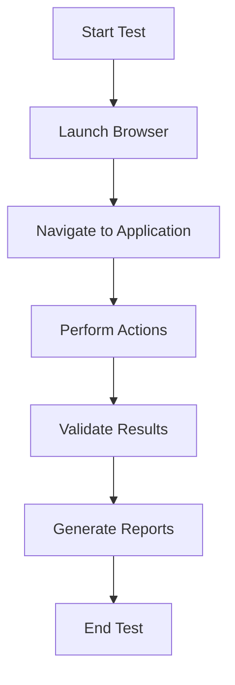

"# Clinical-Trial-Management-Automation-using-Python-Playwright" 
"# Clinical-Trial-Management-Automation-using-Python-Playwright" 
<p align="center">
  
  
  
  
  
</p>

## Test Automation Flow (Playwright)





# Clinical Trial Management Automation using Python & Playwright
This project automates the core workflows of a Clinical Trial Management System using Playwright with Python. It includes test scenarios like login, patient management, oncology data verification, and report validation, ensuring fast and reliable test execution.
## 🛠 Tech Stack
- Python 3.11
- Playwright (Python)
- Pytest
- VS Code
- Git & GitHub
## 🚀 Features Automated
- User Authentication (Login/Logout)
- Patient Record Handling
- Oncology Clinical Data Validation
- Automated Test Reporting
- Browser-based UI Test Automation
## 📂 Project Structure
clinical_playwright_project/
├── tests/
│   ├── test_login.py
│   ├── test_patient_records.py
│   └── test_reports.py
├── pages/
│   ├── login_page.py
│   ├── dashboard_page.py
│   └── patient_page.py
├── utilities/
│   ├── helpers.py
│   └── logger.py
├── pytest.ini
├── requirements.txt
└── README.md
## ▶️ How to Run Tests

Install dependencies:

## Protocol Audit (QMS)

This framework includes a **Protocol Audit automation blueprint**, representing real clinical audit workflows:

- Site Audits
- Protocol Compliance Checks
- Informed Consent Verification
- Drug Storage & Temperature Compliance

### Protocol Audit → CAPA Flow

1. Protocol Audit is created
2. Major / Minor findings are added
3. Audit is submitted
4. CAPA is automatically triggered
5. CAPA moves through Review → Approval → Effectiveness Check → Closure

## 🔁 Master QMS Lifecycle Flow (Audit → CAPA → Closure)

This project represents a **real enterprise Clinical QMS lifecycle**, designed even without access to a live QMS application.

### 🔹 End-to-End Quality Flow

```text
Document / Protocol Created
        ↓
Protocol Audit Performed
        ↓
Audit Finding Raised (Major / Minor)
        ↓
CAPA Triggered Automatically
        ↓
CAPA Review (QA)
        ↓
CAPA Approval
        ↓
Effectiveness Check
        ↓
QMS Closure

Run all tests:

## 📸 Screenshots
(Add your screenshots here later)
## 🔮 Future Enhancement
- Add Allure Reporting
- Add Logging System
- Add Database Validation Layer
- Integrate CI/CD with GitHub Actions
## 👨‍💻 Developer
Amar 
Amar Gurav  


